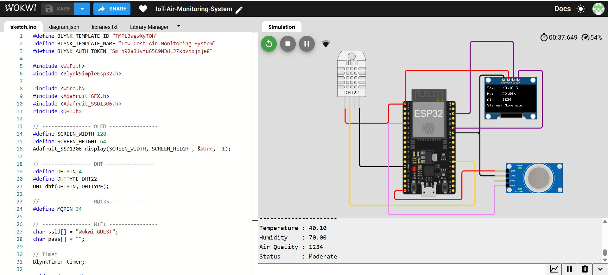
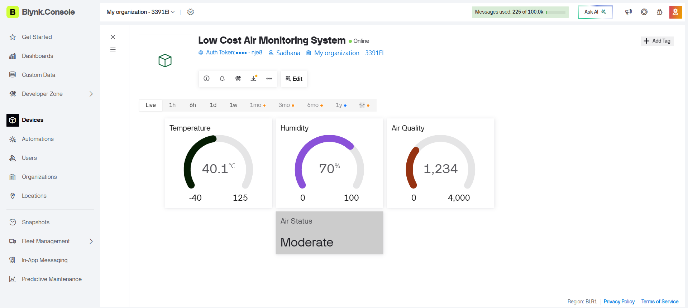

**🌍 Low-Cost Air Monitoring System**

A low-cost IoT-based air monitoring system developed using ESP32, DHT22, MQ135, OLED Display, and Blynk Cloud. The system continuously monitors environmental conditions and displays real-time temperature, humidity, and air quality both locally on an OLED display and remotely through a cloud dashboard.

**📌 Project Overview**

This project provides a simple and affordable solution for monitoring environmental conditions in homes, classrooms, offices, and public spaces.

The ESP32 collects sensor data from the DHT22 and MQ135 sensors, processes it, classifies the air quality status, displays the readings on an OLED screen, and uploads the data to the Blynk IoT platform for remote monitoring.

**✨ Features**

🌡️ Real-time Temperature Monitoring  
💧 Real-time Humidity Monitoring  
🌫️ Air Quality Monitoring using MQ135  
📟 Live OLED Display  
☁️ Cloud Monitoring using Blynk IoT  
📈 Real-time Dashboard Visualization  
🚦 Automatic Air Quality Classification  
  --> 🟢 Good  
  --> 🟡 Moderate  
  --> 🔴 Poor  

**📊 Parameters Monitored**

| Parameter | Sensor |
|-----------|--------|
| Temperature | DHT22 |
| Humidity | DHT22 |
| Air Quality | MQ135 |
| Air Status | Calculated from MQ135 values |

**🚦 Air Quality Classification**

| Air Quality Reading | Status |
|--------------------:|--------|
| 0 – 1199 | 🟢 Good |
| 1200 – 2499 | 🟡 Moderate |
| 2500 – 4095 | 🔴 Poor |

**📸 Screenshots**

**Wokwi Simulation**

**Blynk Dashboard**

**⚙️ Working Principle**

--> ESP32 initializes all connected sensors. 
--> DHT22 measures temperature and humidity. 
--> MQ135 measures surrounding air quality. 
--> ESP32 classifies air quality as Good, Moderate, or Poor. 
--> Sensor readings are displayed on the OLED screen. 
--> Data is transmitted via Wi-Fi to the Blynk Cloud. 
--> Users can monitor environmental conditions remotely using the Blynk dashboard. 

**🚀 Future Enhancements**

The current implementation demonstrates a single-node air monitoring system with cloud connectivity. As a future enhancement, the project can be expanded into a **low-cost wireless air monitoring network** by integrating **NRF24L01 transceiver modules** with multiple ESP32-based sensor nodes. Instead of requiring Wi-Fi at every monitoring location, each node can wirelessly transmit environmental data to a central ESP32 gateway using NRF communication. The gateway can then upload the consolidated data to cloud platforms such as Blynk or ThingSpeak, enabling scalable, cost-effective, and energy-efficient air quality monitoring across campuses, industries, residential areas, and smart city environments.

**🎯 Applications**  
--> Smart Homes  
--> Smart Classrooms  
--> Indoor Air Quality Monitoring  
--> Offices  
--> Hospitals  
--> Laboratories  
--> Industrial Monitoring  
--> Educational IoT Projects  

**👩‍💻 Author**

Sadhanaa2006  
Embedded Systems Enthusiast

